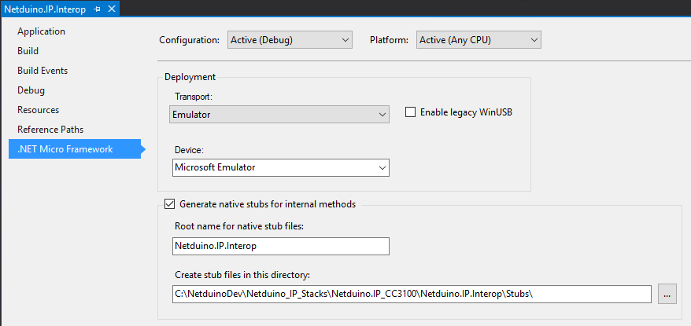

# Building the Netduino.IP Stack for the Embedded Firmware

The managed code from the various networking projects can be embedded in the [firmware](https://github.com/WildernessLabs/Netduino_SDK) when the firmware is built.  This is the standard way in which the Netduino.IP stack is distributed.  Embedding the code in the firmware ensures that the correct link layer is used for the various boards.

## Stub Layers

Although much of the code is managed C#, there is a small amount of C code required.  This code is required to communicate with the various chips (AX88796C, ENC28J60 and CC3100) providing the hardware interface.  The interface between the managed C# and the native C code is provided by a stub layer.

It is easy to see that the API between the managed code and the native code could become out of step.  The consistency of the interface layer is verified by the run time libraries when the libraries are loaded at startup. The verification is performed using a checksum.

### Generating the Checksum

The checksum for the API is initially generated when the stubs are generated the first time the managed code is compiled.  The checksum is added to a stub file and also to the files containing the managed code.  The following shows the checksum entry in the stub generated for the _Netduino.IP.Interop_ project:

```C
const CLR_RT_NativeAssemblyData g_CLR_AssemblyNative_Netduino_IP_Interop =
{
    "Netduino.IP.Interop", 
    0xD8265967,
    method_lookup
};
```

This code was taken from the _Netduino.IP.Interop.cpp_ file in the [Netduino_SDK github repository](https://github.com/WildernessLabs/Netduino_SDK).

It is important to remember that the checksum is also embedded in the managed files deployed to the Netduino board.  So if the API changes then the stubs need to be regenerated and any changes manually copied from the new stubs into the SDK files. This step is manual as the developer will almost certainly modified the native C/C++ files to implement the desired functionality.

If the stubs are not generated then the compiler will not generated the checksum in the managed code.  It will simply add a value of 0 into the file.  This will cause the firmware to fail to load when the board starts as the two values do not match.  If this happens then simply check the project properties for the relevant project and ensure that stubs are being generated for the build type in question:



## Adding to the Firmware

Once the files have ben generated correctly they can be added to the firmware.  This is done by copying the relevant files from the _bin/Release_ and _bin/Release/le_ directory in the compiled project into the associated directory in the [Netduino_SDK directory on your machine](https://github.com/WildernessLabs/Netduino_SDK).