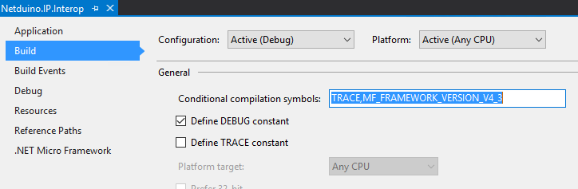
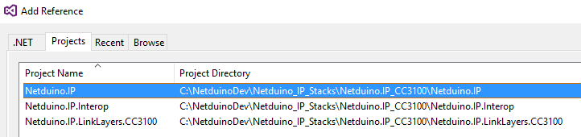

# Debugging the Netduino.IP Stack

The process of setting up a debug project for Netduino.IP is similar for all three of the modern Netduino boards:

* Deploy debug firmware to the board in question
* Create a new Visual Studio project to hold your application
* Add the relevant Netduino.IP, Netduino.IP.Interop and Netduino.IP.LinkLayers projects to your solution
* Ensure that the references are correct

## Netduino Plus 2 and Netduino 3 Ethernet

The sources for these boards can be found in the Netduino.IP directory.  Two of the projects (Netduino.IP and Netduino.IP.Interop) are common to both boards.

A different driver chip is use for both of these boards.  It is necessary to ensure that the correct link layer is used for your board.

| Board               | Driver Chip | Link Layer                      |
|---------------------|-------------|---------------------------------|
| Netduino Plus 2     | ENC28J60    | Netduino.IP.LinkLayers.ENC28J60 |
| Netduino 3 Ethernet | AX88796C    | Netduino.IP.LinkLayers.AX88796C |

These two boards also require a preprocessor macro to be defined in order for the code to compile correctly:

| Board               | Macro               |
|---------------------|---------------------|
| Netduino Plus 2     | NETDUINOIP_ENC28J60 |
| Netduino 3 Ethernet | NETDUINOIP_AX88796C |

These macros should be added to Build properties section of the **Netduino.IP** project (Right click on the Netduino.IP projects, select Properties and then select the Build properties tab):

The relevant macro should be added to the _Conditional compilation symbols_ entry of this tab. A comma separates the macros in this tab.

## Netduino 3 WiFi

The Netduino 3 WiFi board uses the Texas Instruments CC3100 WiFi chip to provide network services. The implementation of the Netduino.IP stack differs from the Netduino Plus 2 and Netduino 3 Ethernet boards.  The changes are significant and the implementation has been separated out into the Netduino.IP_CC3100 directory.

## Checking the References

The final step is to check that the references are correct and to add the required references to your project.

For the Netduino 3 WiFi the references required are as follows:

| Project                       | Reference Required                           |
|-------------------------------|----------------------------------------------|
| Your Project                  | Netduino.IP Netduino.IP.LinkLayers.CC3100 |
| Netduino.IP                   | Netduino.IP.Interop                          |
| Netduino.IP.LinkLayers.CC3100 | Netduino.IP Netduino.IP.Interop           |
| Netduino.IP.Interop           | None required                                |

The references added should be from the _Projects_ tab of the _Add References_ dialog box when viewed from your project.

## Compiling Your Application

You should now be ready to compile your application, set break points, single step all from within Visual Studio.